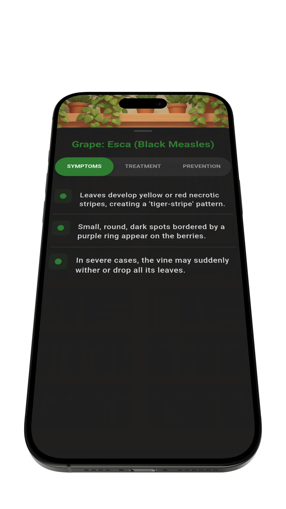
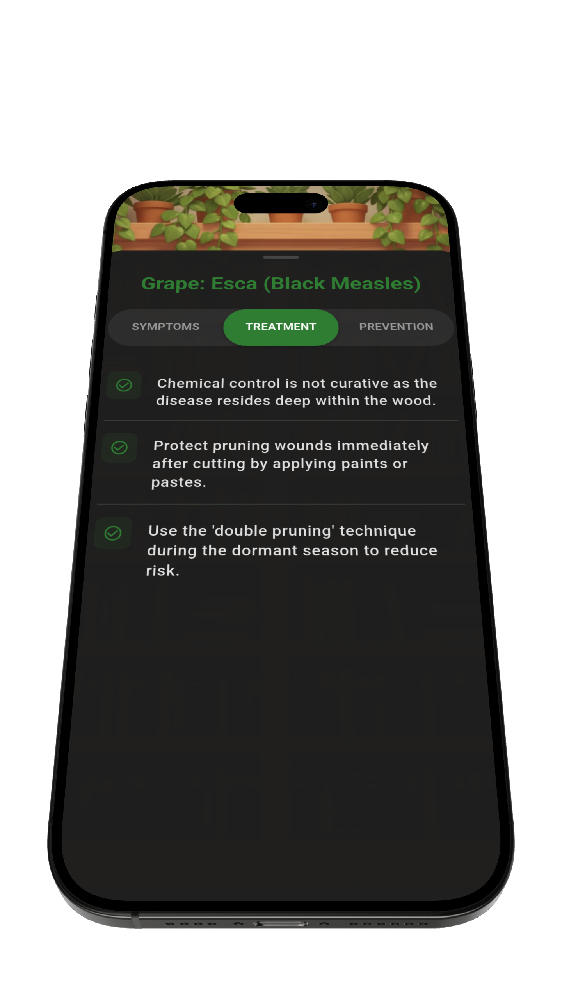
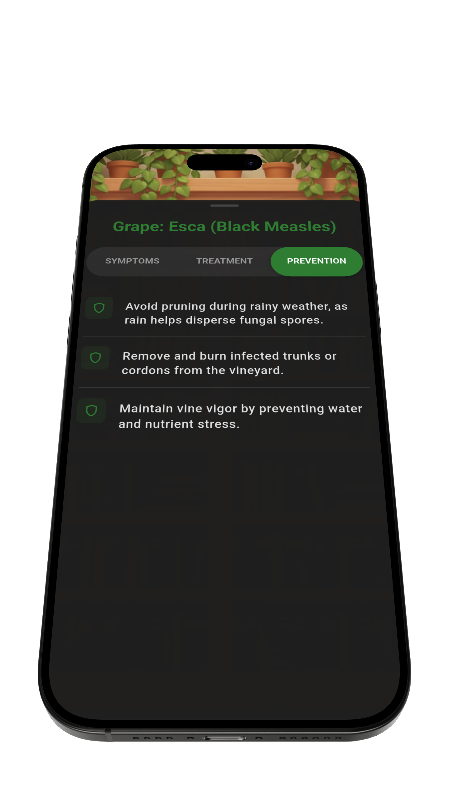

<div align="center">
  
  <h1>PLANT DISEASE EARLY DIAGNOSIS SYSTEM</h1>
  <p>
    <strong>GreenHealer:</strong> Offline & Real-time Plant Pathology on the Edge
  </p>

  <p>
    <a href="https://www.python.org/">
      
    </a>
    <a href="https://www.tensorflow.org/">
      
    </a>
    <a href="https://flutter.dev/">
      
    </a>
    <a href="./LICENSE">
      
    </a>
  </p>
</div>

This repository hosts a robust deep learning pipeline optimized for offline mobile inference via TensorFlow Lite. Built upon the MobileNetV3Large architecture, it serves as the intelligent core of the GreenHealer application, providing high-accuracy detection of 38 plant diseases across 14 crop species. The system is specifically architected to operate efficiently in low-connectivity regions, supporting sustainable farming through rapid, data-driven diagnosis.

GreenHealer was developed as a focal project within the **United Nations Development Programme (UNDP) & Samsung Innovation Campus** program. The initiative is specifically engineered to address several Sustainable Development Goals (SDGs) by leveraging edge AI technology:

*   **SDG 2 (Zero Hunger):** Preventing crop loss through early diagnosis to ensure food security.
*   **SDG 10 (Reduced Inequalities):** Providing accessible AI tools to smallholder farmers, bridging the technological gap.
*   **SDG 12 (Responsible Consumption):** Enabling targeted treatment of plant diseases to reduce excessive chemical usage.
*   **SDG 15 (Life on Land):** Promoting overall plant health and protecting biodiversity through efficient pathology.

<details>
<summary><b>Click to expand project structure details</b></summary>

```text
.
├── configs
│   └── config.yaml                         # Configuration file for hyperparameters and directory paths
├── datasets
│   ├── raw                                 # Raw PlantVillage dataset
│   └── split                               # Processed data split into Train/Val/Test sets
├── docs
│   └── assets                              # Documentation and showcase assets (videos, screenshots)
├── .github
│   └── workflows                           # GitHub Actions CI/CD pipelines
├── logs                                    # Centralized directory for TensorBoard and execution logs
├── mobile
│   ├── assets                              # Mobile application assets (icons, images, TFLite models)
│   └── lib                                 # GreenHealer mobile application source code (Dart/Flutter)
├── outputs
│   └── model_v1                            # Versioned model training outputs
│       ├── checkpoints                     # Saved Keras and TFLite (.tflite) weights
│       ├── figures                         # Performance visualization plots (Confusion Matrix, ROC, etc.)
│       └── tables                          # Metric reports and class metadata
├── scripts
│   └── prepare_data.py                     # Script for dataset splitting and preparation
├── src
│   ├── analysis                            # Evaluation logic and visualization utilities
│   ├── core                                # Dataclass configuration loading and path management
│   ├── data                                # Dataset pipeline (PlantDataLoader)
│   └── modeling                            # MobileNetV3 architecture (net) and training loop (trainer)
├── tests
│   ├── check_data_integrity.py             # Pytest class for verifying data distributions and pixel bounds
│   ├── conftest.py                         # Pytest configuration and shared fixtures
│   ├── test_data_loader.py                 # Unit tests for the data ingestion pipeline
│   └── test_inference.py                   # Unit tests for prediction logic and TFLite models
├── .gitignore                              # Git tracking exclusions
├── .pre-commit-config.yaml                 # Automated pre-commit hooks (Ruff, MyPy)
├── pyproject.toml                          # Python project metadata and tool configs
├── README.md                               # Project main documentation
├── requirements.txt                        # Core Python dependencies
├── evaluate.py                             # Script for evaluating model performance
├── export.py                               # Script for TFLite Int8 quantization and mobile export
├── inference.py                            # Script for single-image inference and latency testing
└── train.py                                # Main script to initiate the Two-Stage model training
```

</details>

<details>
<summary><b>Click to expand technology stack details</b></summary>

| Component | Technology | Purpose |
|:---|:---|:---|
| ML Framework | TensorFlow / Keras | Model training and evaluation |
| Backbone | MobileNetV3-Large | Feature extraction (ImageNet pretrained) |
| Quantization | TFLite Int8 PTQ | Edge deployment optimization |
| Mobile Runtime | TensorFlow Lite | On-device inference engine |
| Mobile UI | Flutter / Dart | Cross-platform mobile application |
| CI/CD | GitHub Actions | Automated testing and linting |
| Quality | Ruff, MyPy, pre-commit | Code quality enforcement |

</details>

## Table of Contents
- [Interface & Showcases](#interface--showcases)
- [Methodology & Technical Specifications](#methodology--technical-specifications)
- [Dependencies](#dependencies)
- [Quickstart](#quickstart)
- [Results & Metrics](#results--metrics)
- [Limitations & Disclaimers](#limitations--disclaimers)
- [References](#references)

## Interface & Showcases

GreenHealer provides a sophisticated, offline-first mobile experience meticulously engineered for high-performance deployment in frontline agricultural environments. The interface is optimized for rapid field assessments, enabling farmers and agronomists to perform complex pathological diagnostics with minimal latency. By eliminating reliance on cloud connectivity, the system ensures that critical agricultural intelligence remains accessible and actionable in remote environments, bridging the gap between advanced deep learning and practical on-the-ground application.

---

<table width="100%">
  <tr align="center" valign="top">
    <td width="33%">
      <b>Interactive Onboarding</b><br><br>
      
    </td>
    <td width="33%">
      <b>On-Device Analysis</b><br><br>
      
    </td>
    <td width="33%">
      <b>Diagnosis Results</b><br><br>
      
    </td>
  </tr>
</table>

The GreenHealer consultation workflow integrates plant pathology analysis into a seamless mobile experience. Users are guided through a step-by-step diagnostic process where the on-device model identifies disease signatures in real time. The workflow provides high-confidence classification results along with immediate access to treatment protocols, all without requiring an internet connection.

---

<table width="100%">
  <tr align="center" valign="top">
    <td width="33%">
      <b>Symptom Analysis</b><br><br>
      
    </td>
    <td width="33%">
      <b>Precision Treatment</b><br><br>
      
    </td>
    <td width="33%">
      <b>Prevention Protocols</b><br><br>
      
    </td>
  </tr>
</table>

Beyond real-time diagnosis, GreenHealer serves as a comprehensive knowledge base for sustainable agriculture. The curated botanical repository provides detailed information on disease morphology, targeted treatment methods, and layered prevention strategies. This enables farmers and specialists to go beyond simple identification and implement effective, evidence-based interventions to protect crop health.

To ensure technical accuracy, the pathological data and treatment guidelines within this repository have been compiled from authoritative academic literature and peer-reviewed research in the field of plant pathology. This research-driven approach ensures that the diagnostic outputs are aligned with established agricultural science, providing users with evidence-based and actionable field guidance.

## Methodology & Technical Specifications

### 1. Model Architecture: MobileNetV3-Large
The system is built upon MobileNetV3-Large, a highly efficient convolutional architecture optimized for mobile CPUs.
- **Backbone:** Pre-trained on ImageNet (1k classes) to leverage learned high-level features (edges, textures).
- **Custom Head:** The original top layer was removed and replaced with:
  - `GlobalAveragePooling2D`: To reduce spatial dimensions and parameters.
  - `Dropout(0.2)`: To prevent overfitting by randomly dropping neurons during training.
  - `Dense(38, Softmax)`: The final classification layer for the specific plant pathology classes.

### 2. Strategic Two-Stage Training
To maximize accuracy without destroying the pre-trained weights ("catastrophic forgetting"), a rigorous two-stage regime was employed:

* Stage 1: Head Warming (Transfer Learning)
    * **Frozen Backbone:** All MobileNetV3 layers were frozen.
    * **Objective:** Train only the new custom head to adapt random weights to meaningful feature representations.
    * **Hyperparameters:** Learning Rate = 1e-3, Epochs = 15.

* Stage 2: Fine-Tuning with BN Freezing
    * **Unfrozen Backbone:** The base model was unfrozen to allow weight updates.
    * **Critical Technique (Batch Normalization Freezing):** While the convolutional layers were trainable, the BatchNormalization layers were kept frozen in inference mode. This preserves the robust statistical mean/variance learned from ImageNet, preventing the model from degrading on the smaller PlantVillage dataset.
    * **Hyperparameters:** Learning Rate = 1e-4 (Low LR to fine-tune gently), Epochs = 30.

### 3. Handling Class Imbalance
The dataset exhibits class imbalance. To ensure balanced learning across all 38 classes, we apply **Inverse Frequency Class Weighting** during the loss calculation:

$$W_j = \frac{N}{K \cdot n_j}$$

> *Where **$N$** is the total samples, **$K$** is the number of classes, and **$n_j$** is the number of samples in class **$j$**.*

- **Strategic Impact:** Misclassifying a rare "Potato Healthy" sample penalizes the loss function ~9x more than a common class, forcing the model to learn minority features equally well.

### 4. Data Augmentation Pipeline
To ensure generalization to real-world field conditions (variable lighting, angles), the following augmentations are applied on-the-fly:
- **RandomRotation (0.2):** Simulates camera orientation changes.
- **RandomZoom (0.2):** Simulates varying distances from the leaf.
- **RandomContrast (0.2):** Simulates shadows and lighting conditions.
- **RandomFlip (Horizontal/Vertical):** Increases data diversity.

### 5. Edge Optimization (Quantization)
The final FP32 Keras model (~18 MB) was optimized for mobile deployment using **Post-Training Quantization (PTQ)**:
- **Integer Quantization (Int8 weights, Float32 output):** Weights and activations were quantized to 8-bit integers. The input accepts UInt8 tensors, while the output remains Float32 for classification accuracy.
- **Result:**
  - **Size Reduction:** ~18 MB -> ~3 MB (83% reduction).
  - **Latency:** 5.58 ms inference time on CPU.
  - **Hardware Compatibility:** Enabled hardware acceleration on mobile DSPs/NPUs via TensorFlow Lite.

## Dependencies

To ensure reproducibility and isolate dependencies, it is recommended to use a virtual environment.

### Step 1 — Environment Setup:

```bash
# Create a virtual environment
python -m venv venv

# Activate (Linux/macOS)
source venv/bin/activate

# Activate (Windows)
venv\Scripts\activate
```
### Step 2 — Install Packages:

```bash
pip install -r requirements.txt
```

*Core Dependencies: `tensorflow`, `keras`, `opencv-python-headless`, `pandas`, `numpy`, `scikit-learn`, `matplotlib`, `seaborn`, `pyyaml`, `tqdm`, `pillow`.*

## Quickstart

### Prerequisites

* **Hardware:** NVIDIA GPU (Recommended for training), CPU (Sufficient for inference).
* **Data:** Download the [PlantVillage Dataset](https://www.kaggle.com/datasets/mustafaberatyavas/plantvillage-dataset) and extract the raw folders into `datasets/raw`.

---

### 1. Data Preparation
Split the raw dataset into Train (80%), Validation (10%), and Test (10%) sets using the configuration defined in `configs/config.yaml`.

```bash
python scripts/prepare_data.py
```

### 2. Training the Model

Initiate the Two-Stage Training process (Head Warming + Fine-Tuning). Artifacts (weights, logs) will be saved to `outputs/model_v1/`.

```bash
python train.py
```

### 3. Evaluation

Evaluate the best-performing model on the held-out Test set to generate the Confusion Matrix and Classification Report.

```bash
python evaluate.py --model outputs/model_v1/checkpoints/best_model.keras
```

### 4. TFLite Conversion

Convert the trained Keras model into an Int8 Quantized TensorFlow Lite model (`.tflite`) for mobile deployment. This script also copies the model to the `mobile/assets/` directory.

```bash
python export.py --model outputs/model_v1/checkpoints/best_model.keras
```

### 5. Running Inference

Run inference on a single image using the quantized mobile model to verify accuracy and latency.

>**Note:** Replace the image path with any valid sample from your test set.

```bash
python inference.py \
  --image datasets/split/test/Tomato___Early_blight/sample_image.jpg \
  --model outputs/model_v1/checkpoints/best_model_quantized.tflite
```

## Results & Metrics

The system was benchmarked on the held-out test set (5,459 images) using a standard CPU environment to simulate edge capability.

| Metric | Score | Significance |
| :--- | :--- | :--- |
| Accuracy | 99.21% | High classification accuracy on the PlantVillage test set (5,416/5,459 correct). |
| Weighted Precision | 0.9924 | High reliability; minimizes false positives across classes. |
| Macro F1 | 0.9910 | Demonstrates balanced learning across all 38 classes. |
| Avg. Latency | 5.58 ms | Real-time performance suitable for live camera feeds (~179 FPS). |
| Model Size | 3.0 MB | Extremely lightweight (Int8 Quantized), enabling OTA updates. |
| Model Parameters | 3,032,870 | Highly efficient MobileNetV3Large backbone. |

## Limitations & Disclaimers

> **Important:** This section is critical for understanding the real-world applicability of the reported metrics.

### Dataset Constraints
The PlantVillage dataset, while comprehensive in class coverage, was captured under **controlled laboratory conditions** with uniform backgrounds and consistent lighting. This introduces a significant domain gap when deploying to real-world agricultural environments where:

- **Background complexity** varies dramatically (soil, other plants, sky)
- **Lighting conditions** range from direct sunlight to overcast shadows
- **Leaf orientation and occlusion** are unpredictable
- **Disease progression stages** may not match the curated samples
- **Co-occurring diseases** on a single leaf are not represented in the dataset

### Accuracy Disclaimer
The reported **99.21% accuracy** reflects performance on the PlantVillage test set, which shares the same distribution as the training data. **Real-world field accuracy is expected to be lower.** Users should treat the model's predictions as preliminary assessments, not definitive diagnoses, and consult professional agronomists for critical decisions.

### Statistical Limitations
- Results are based on a **single train/test split** (no k-fold cross-validation)
- The dataset does not cover all known plant diseases or all crop species globally
- Performance on crop varieties not represented in the dataset is unknown

### Intended Use
This system is designed as a **decision-support tool** for farmers and agronomists, not as a replacement for professional plant pathology expertise. It is optimized for the 14 crop species and 38 disease classes present in the training data.

## References

The MobileNetV3 architecture used in this project is based on the following research:

```bibtex
@inproceedings{howard2019searching,
  title={Searching for MobileNetV3},
  author={Howard, Andrew and Sandler, Mark and Chu, Grace and Chen, Liang-Chieh and Chen, Bo and Tan, Mingxing and Wang, Weijun and Zhu, Yukun and Pang, Ruoming and Vasudevan, Vijay and others},
  booktitle={Proceedings of the IEEE/CVF International Conference on Computer Vision},
  pages={1314--1324},
  year={2019}
}
```